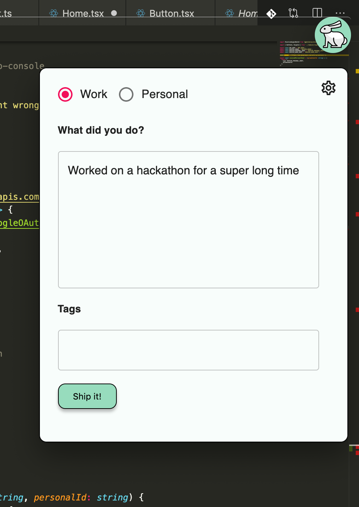

# Pioneer Hackathon – White Rabbit 
To help you keep track of time!      

Have you ever had a thought "wow, what did I do this week? Where did the time go?". Me too! White Rabbit is here to help. 




This is an electron app that is ever-present on your screen, even if you're coding in fullscreen mode. And ever so often he'll nudge you to record what you've done in the last couple of hours, or always available whenever you're ready to record a task you've been working on 


All this is recorded and aggregated to Google Spreadsheets (or Google Docs). Your work teammates will also publish to the same work Google doc, and over time WhiteRabbit will help you build a historical overview of the work that has been done, broken down by date, project, team-member and any other tags.

You can also create the same data set with personal tasks as well that work the same way except that the data is only accessible to only you. 

To run, you will need CLIENT_ID & CLIENT_SECRET env variables from Google API, and then simply:
```
yarn
yarn dev
```

To publish to an electorn app:
```
yarn package
```
