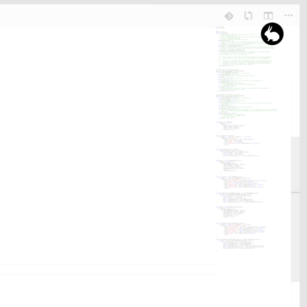
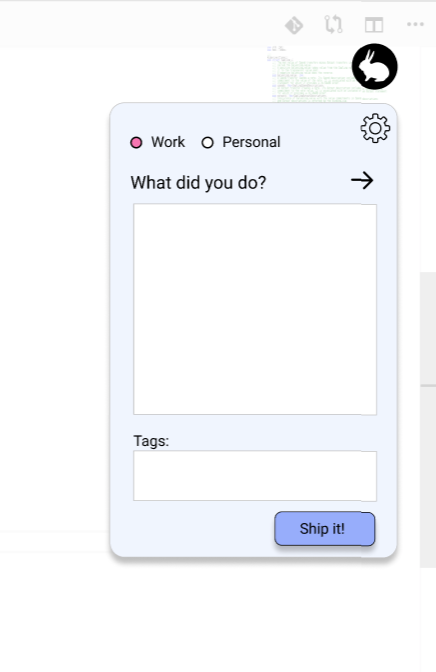
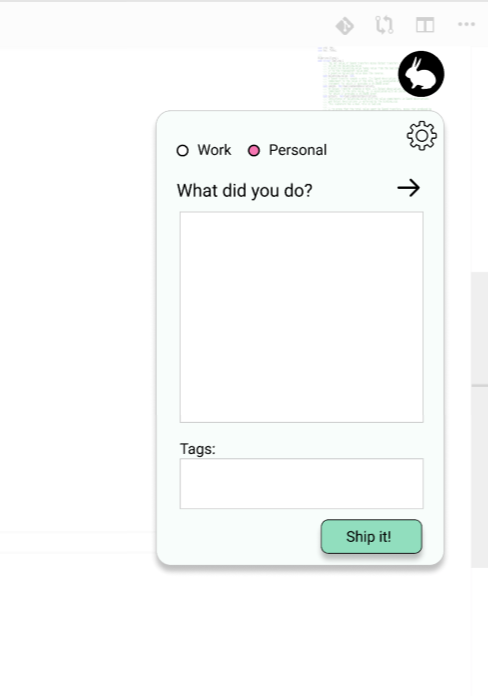

# Pioneer Hackathon – White Rabbit 
To help you keep track of time!      

Have you ever had a thought "wow, what did I do this week? Where did the time go?". Me too! White Rabbit is here to help. 

This is an app that is ever-present on your screen, even if you're coding in fullscreen mode. And ever so often he'll nudge you to record what you've done in the last couple of hours. 

You can also record your personal activities also:

All this is recorded and aggregated to Google Spreadsheets (or Google Docs). Your work teammates will also publish to the same work Google doc, and over time WhiteRabbit will help you build a historical overview of the work that has been done, broken down by date, project and team-member. Your personal historical data is sorted the same way, but accessible to only you. 
